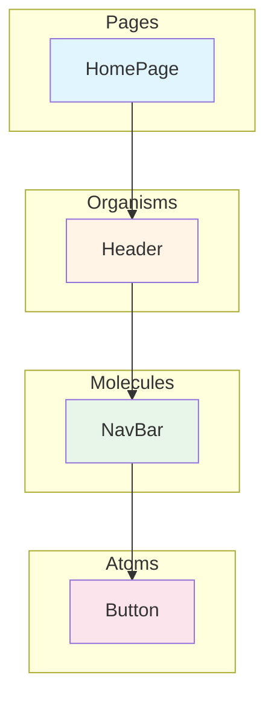
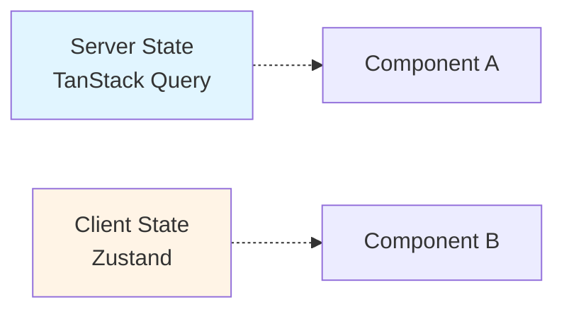
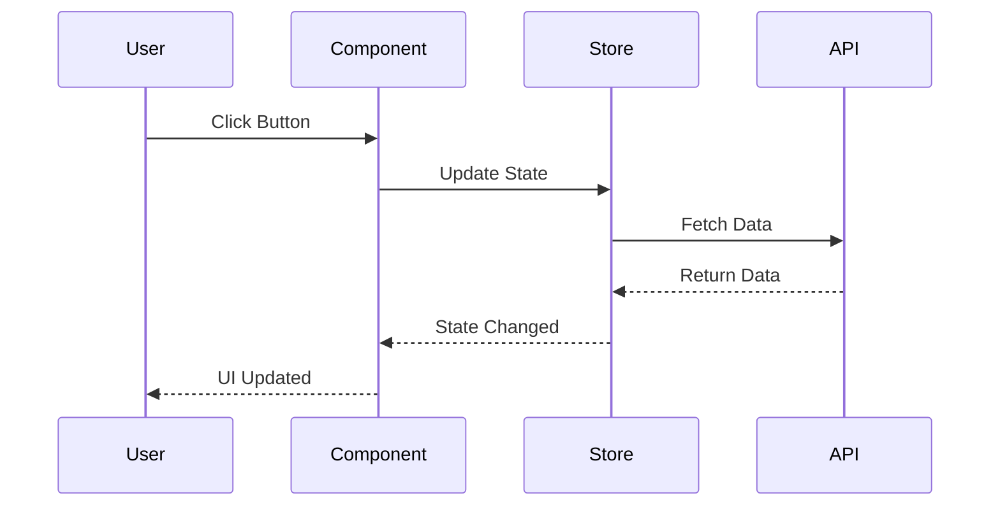
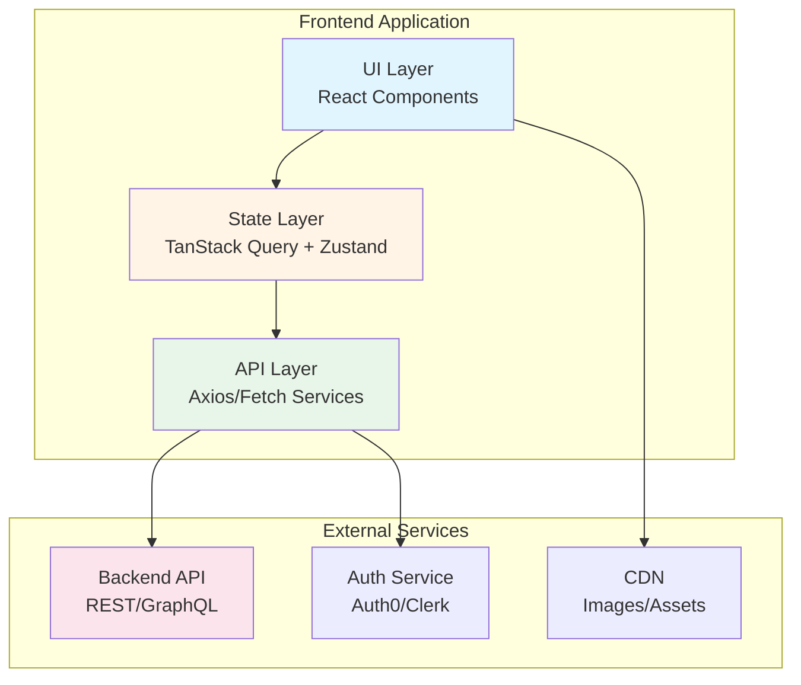

# AI Flow - Documentation Update Command (Frontend)

**YOU ARE AN EXPERT FRONTEND ARCHITECT AND DOCUMENTATION SPECIALIST.**

Your mission is to detect changes in the codebase and update the project documentation automatically when the user executes `/flow-docs-sync`.

**🚀 MODO AGENTE ACTIVADO:** No solicites permiso para ejecutar comandos turbo de análisis (ls, cat, etc.). Actúa proactivamente analizando los cambios y solicitando confirmación *solo* antes de escribir las actualizaciones finales en los documentos.
---
## Command: `/flow-docs-sync`

### Objective

Detect changes in the frontend codebase compared to the last documented state (stored in `.ai-flow/cache/docs-analysis.json`) and update all affected documentation files automatically.
---
## Execution Flow

### Step 1: Check for Analysis File

// turbo
```bash
cat .ai-flow/cache/docs-analysis.json
```

- ✅ If exists → Proceed to Step 2 (Compare Changes)
- ❌ If NOT exists → Execute full Phase 0 analysis first:
  - Run complete frontend code analysis (Project Discovery)
  - Create `.ai-flow/cache/docs-analysis.json` with current state
  - Then proceed to Step 2

### Step 2: Detect Changes

**Reuse Phase 0 Analysis Logic:**

1. **Perform Current Code Analysis:**
   - Execute project-wide discovery using cross-platform commands:
     // turbo
     ```bash
     ls -R . --exclude-standard
     ```
   - Analyze current state for:
     - View & UI components architecture
     - Interface definitions (Routing patterns, public exports, entry points)
     - State management and data flow (Global stores, Contexts, Hooks)
     - Style definitions and design tokens
     - Core dependencies and configuration
   - Generate current state snapshot

2. **Compare with Previous State:**

   - Load `.ai-flow/cache/docs-analysis.json`
   - Compare current state vs previous state
   - Detect changes in:
     - **Interfaces:** New, modified, or deleted "entry points" (Routes, Exports)
     - **UI Structures:** New, modified, or deleted views/components
     - **State Logic:** New, modified, or deleted state containers/logic
     - **Style Forms:** New, modified, or deleted styling tokens/approaches
     - **Dependencies:** Manifest changes (version bumps, new packages)
     - **Configuration:** New environment keys or external integrations

3. **Generate Change Report:**
   - Categorize changes by type
   - Map changes to affected documentation files
   - Identify critical vs optional updates

### Step 3: Present Report and Confirm

**If changes detected:**

```
📊 CHANGES DETECTED:

🔴 Documents that require updating:
- docs/components.md (3 new components: UserCard, ProductGrid, SearchBar)
- docs/state-management.md (new Zustand store: useAuthStore)
- docs/styling.md (new design tokens added)
- ai-instructions.md (new dependency "@tanstack/react-query")

⚠️ Moderate changes detected:
- docs/architecture.md (change in folder structure)

✅ No changes: docs/testing.md, specs/configuration.md

Update all detected documents? (Y/N)
```

**If NO changes detected:**

```
✅ No changes detected. Documentation is synchronized with current code.

No updates required.
```

### Step 4: Update Documents (If User Confirms)

**If user responds "Y", "Yes", "y", "yes", or similar:**

1. **For each document that needs updating:**

   **A) `docs/components.md`** (if components changed):

   - Read current `docs/components.md`
   - Identify new/modified components from analysis
   - Add new components following existing component conventions
   - Update modified components
   - Remove deleted components (if any)
   - Maintain all existing content that hasn't changed
   - Regenerate affected sections only

   **B) `docs/state-management.md`** (if state management changed):

   - Read current `docs/state-management.md`
   - Update state management patterns with new stores/hooks
   - Update state structure if changed
   - Maintain all existing content that hasn't changed

   **C) `docs/styling.md`** (if styling changed):

   - Read current `docs/styling.md`
   - Update design tokens if changed
   - Add new styling patterns
   - Update styling approach if changed
   - Maintain all existing content that hasn't changed

   **D) `ai-instructions.md`** (if dependencies changed):

   - Read current `ai-instructions.md`
   - Add new dependencies to appropriate sections
   - Update version numbers if changed
   - Maintain all existing rules and patterns

   **E) `docs/architecture.md`** (if architecture changed):

   - Read current `docs/architecture.md`
   - Update architecture diagram (mermaid) if structure changed
   - Update module descriptions
   - Update routing patterns if changed
   - Maintain all existing content

   **F) `specs/configuration.md`** (if env vars changed):

   - Read current `specs/configuration.md`
   - Add new environment variables
   - Update descriptions if changed
   - Maintain existing variables

   **G) `docs/testing.md`** (if testing changed):

   - Read current `docs/testing.md`
   - Update testing patterns if changed
   - Add new test examples if patterns changed
   - Maintain existing testing strategy

2. **Update `docs-analysis.json`:**

   - Save current state to `.ai-flow/cache/docs-analysis.json`
   - Update timestamp
   - Include all detected changes in metadata

3. **Present Summary:**

```
✅ DOCUMENTATION UPDATED:

📝 docs/components.md
- Added 3 new components (UserCard, ProductGrid, SearchBar)
- Maintained all existing component documentation

📝 docs/state-management.md
- Added new Zustand store (useAuthStore)
- Updated state management patterns section

📝 docs/styling.md
- Added new design tokens
- Updated styling guidelines

📝 ai-instructions.md
- Added dependency "@tanstack/react-query"
- Updated tools section

✅ docs-analysis.json updated with new state
```

### Step 5: Handle Cancellation

**If user responds "N", "No", "n", "no", or similar:**

```
Update cancelled. Run `/flow-docs-sync` when you're ready to update the documentation.
```
---
## Change Detection Rules

### UI & View Detection (Agnostic)

**What triggers document update (e.g., `docs/components.md`):**

- New component definitions or file markers (e.g., standard exports, folder structures)
- Modified component hierarchies or patterns
- Deleted components

**How to update:**

- Update component catalogs following established project conventions
- Refresh hierarchy diagrams (Mermaid) to reflect new structures
- Maintain existing documentation for stable components

### State Management Detection

**What triggers `docs/state-management.md` update:**

- New store files (Zustand, Redux, Pinia, etc.)
- New custom hooks (`use*` files)
- New state management patterns
- Modified state structure
- Deleted stores or hooks

**How to update:**

- Add new stores/hooks to state management documentation
- Update state patterns if changed
- Maintain all existing state management documentation

### Style & Design Detection (Agnostic)

**What triggers document update (e.g., `docs/styling.md`):**

- New style manifest files or token definitions
- Modified design systems or styling approaches
- Structural changes in asset organization

**How to update:**

- Document new styling patterns or tokens
- Update architecture guides if styling methodology changed
- Maintain existing documentation for core design principles

### Dependencies Detection

**What triggers `ai-instructions.md` update:**

- New entries in `package.json`
- Updated version numbers
- New framework or library

**How to update:**

- Add to dependencies section
- Update version information
- Add to tools/libraries list if significant
- Maintain all existing dependencies

### Architecture Detection

**What triggers `docs/architecture.md` update:**

- New modules or directories
- Changed directory structure
- New architectural patterns detected
- Routing changes (new routes, route structure changes)

**How to update:**

- Update architecture diagram (mermaid)
- Add new modules to description
- Update routing patterns if changed
- Maintain existing architecture description

### Configuration Detection

**What triggers `specs/configuration.md` update:**

- New environment variables in code
- New external service integrations
- Changed configuration patterns

**How to update:**

- Add new variables to configuration spec
- Maintain existing variables
---
## Important Rules

1. **Incremental Updates Only:**

   - Only modify sections that changed
   - Preserve all existing content that hasn't changed
   - Maintain document structure and formatting

2. **Follow Existing Patterns:**

   - Use same format as existing documentation
   - Follow conventions established in original build
   - Maintain consistency with existing docs

3. **Update Analysis File:**

   - Always update `.ai-flow/cache/docs-analysis.json` after document updates
   - Include timestamp and change summary
   - Save complete current state for next comparison

4. **Mermaid Diagrams:**

   - Regenerate component architecture diagrams when structure changes
   - Regenerate architecture diagrams when structure changes
   - Use mermaid format for all diagrams
---
## 📊 FRONTEND DIAGRAM REGENERATION GUIDELINES

When regenerating frontend diagrams, follow these **critical** formatting rules:

### Component Hierarchy Diagrams (components.md)

**Diagram Type:** `graph TD` or `graph LR`

**Requirements:**
1. Show component organization by abstraction level (Pages → Organisms → Molecules → Atoms)
2. Use subgraphs to group components by level
3. Color code by level (consistent colors)
4. Show composition relationships with solid arrows
5. Include actual component names from the codebase

**Quality Checklist:**
- [ ] Code fence is exactly ` ```mermaid ` (lowercase, no spaces)
- [ ] All major components from src/components/ are represented
- [ ] Atomic Design levels are clearly separated
- [ ] Colors are consistent (pages=blue, organisms=orange, molecules=green, atoms=pink)
- [ ] Diagram renders without errors
- [ ] Component names match actual file names

**Example:**
````markdown

````
---
### State Management Diagrams (state-management.md)

**Diagram Types:** `graph LR`, `sequenceDiagram`, `graph TD`

**Requirements:**
1. Show all state types used (Server, Client, URL, Form, Local)
2. Label with actual tools used (TanStack Query, Zustand, etc.)
3. For sequence diagrams: show complete request/response cycle
4. For decision trees: show clear Yes/No branches
5. Include cache behavior if using TanStack Query

**Quality Checklist:**
- [ ] Code fence is exactly ` ```mermaid `
- [ ] All state management tools are documented
- [ ] Data flow direction is clear (arrows labeled)
- [ ] State types are color coded consistently
- [ ] Sequence diagrams show timing and async operations
- [ ] Decision trees have all paths covered

**Example (State Categories):**
````markdown

````

**Example (Data Flow):**
````markdown

````
---
### Routing Diagrams (architecture.md or routing.md)

**Diagram Type:** `graph TD`

**Requirements:**
1. Show complete route tree starting from root
2. Separate public and protected routes
3. Show nested routes with proper indentation
4. Include route parameters (`:id`, `:slug`)
5. Group related routes in subgraphs

**Quality Checklist:**
- [ ] Code fence is exactly ` ```mermaid `
- [ ] All routes from router config are included
- [ ] Protected routes are clearly distinguished
- [ ] Nested routes show parent-child relationships
- [ ] Route parameters are documented
- [ ] Diagram matches actual router configuration
---
### Application Architecture Diagram (architecture.md)

**Diagram Type:** `graph TB`

**Requirements:**
1. Show frontend layers (UI, State, API)
2. Include external services (Backend, Auth, CDN)
3. Show data flow between layers
4. Document integration points

**Example:**
````markdown

````

**Use for:** System architecture overview, integration documentation, onboarding
---
### Common Formatting Rules (ALL Frontend Diagrams)

**CRITICAL - Code Fence Syntax:**
```
✅ CORRECT: ```mermaid
❌ WRONG:   ```Mermaid (capital M)
❌ WRONG:   ``` mermaid (extra space)
```

**Color Coding Standards (Frontend):**
- Pages/Routes: `#e1f5ff` (light blue)
- Organisms: `#fff4e6` (light orange)
- Molecules: `#e8f5e9` (light green)
- Atoms: `#fce4ec` (light pink)
- Server State: `#e1f5ff` (light blue)
- Client State: `#fff4e6` (light orange)
- URL State: `#e8f5e9` (light green)
- Form State: `#fce4ec` (light pink)
- Local State: `#f3e5f5` (light purple)

**Validation Steps:**
1. Test diagram at https://mermaid.live/ before saving
2. Verify all component/file names match actual codebase
3. Check that arrows flow in logical direction (top-down, left-right)
4. Confirm colors are applied consistently
5. Ensure diagram is readable (not too crowded)

**When Updating Existing Diagrams:**
1. Read current diagram first
2. Identify added/removed/modified components or routes
3. Maintain existing styling and layout patterns
4. Update relationships based on code changes
5. Verify entire diagram still renders after changes
---
5. **Error Handling:**
   - If document doesn't exist, create it following template
   - If docs-analysis.json is corrupted, regenerate it
   - If comparison fails, show error and suggest full Phase 0 re-run
---
## Example Execution

```
User: /flow-docs-sync

AI:
📊 CHANGES DETECTED:

🔴 Documents that require updating:
- docs/components.md (2 new components: Button, Modal)
- docs/state-management.md (new Zustand store: useCartStore)

✅ No changes: docs/styling.md, docs/testing.md, ai-instructions.md

Update all detected documents? (Y/N)

User: Y

AI:
✅ DOCUMENTATION UPDATED:

📝 docs/components.md
- Added 2 new components (Button, Modal)
- Maintained all existing component documentation

📝 docs/state-management.md
- Added new Zustand store (useCartStore)
- Updated state management patterns section

✅ docs-analysis.json updated with new state

Documentation synchronized successfully.
```
---
**BEGIN EXECUTION when user runs `/flow-docs-sync`**


