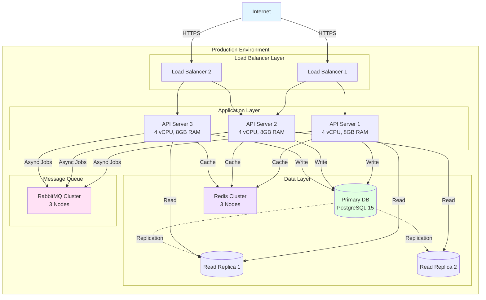
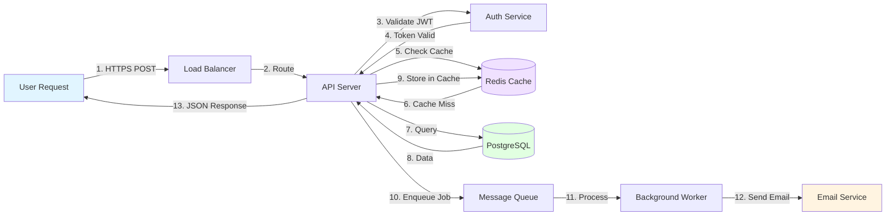
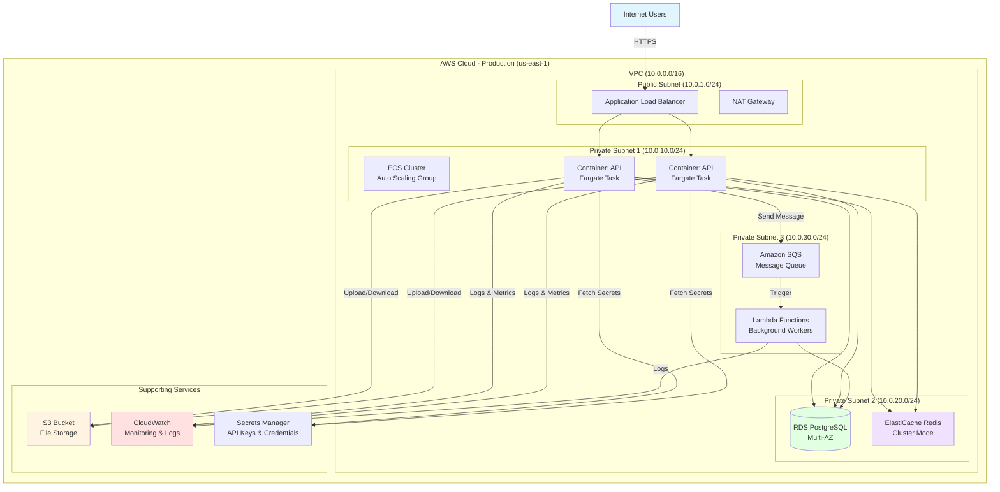
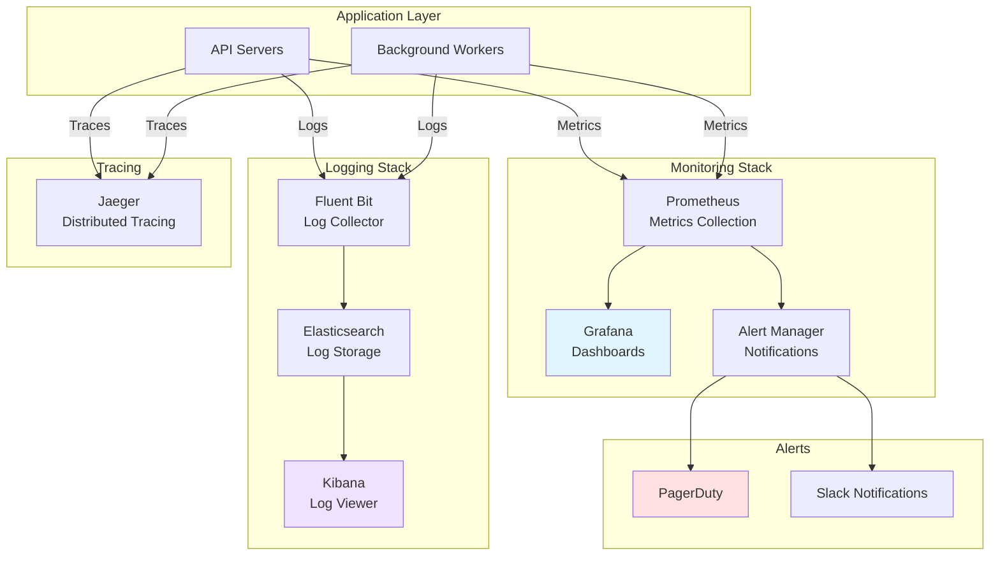

## PHASE 7: Operations & Deployment (10-15 min)

> **Order for this phase:** 7.1 → 7.2 → 7.3 → 7.4 → 7.4.1 → 7.5 → 7.6 → 7.7 → 7.7.1 → 7.7.2 → 7.8 → 7.9 → 7.9.1 → 7.9.2 → 7.9.3 → 7.9.4 → 7.10

> **📌 Scope-based behavior:**
>
> - **MVP:** Ask 7.1-7.4 only (deployment basics), skip 7.5-7.10 (monitoring, scaling, backups), mark as "TBD"
> - **Production-Ready:** Ask 7.1-7.8, simplify 7.9-7.10 (advanced monitoring and resilience)
> - **Enterprise:** Ask all questions 7.1-7.10 with emphasis on reliability and disaster recovery

### Objective

Define deployment, monitoring, and operational practices.

---

## 🔍 Pre-Flight Check (Smart Skip Logic)

> 📎 **Reference:** See [prompts/shared/smart-skip-preflight.md](../../.ai-flow/prompts/shared/smart-skip-preflight.md) for the complete smart skip logic.

**Execute Pre-Flight Check for Phase 7:**

- **Target File**: `docs/deployment.md`
- **Phase Name**: "OPERATIONS & DEPLOYMENT"
- **Key Items**: CI/CD pipeline, deployment platform, monitoring, logging
- **Typical Gaps**: Incident runbooks, disaster recovery, scaling strategy

**Proceed with appropriate scenario based on audit data from `.ai-flow/cache/audit-data.json`**

---

## Phase 7 Questions (Full Mode)

**7.1 Deployment Environment**

```

Where will you deploy?

A) ⭐ Cloud Platform

- AWS (ECS, Fargate, Lambda, EC2)
- Google Cloud (Cloud Run, GKE, Compute Engine)
- Azure (App Service, AKS, VMs)

B) 🔥 Platform-as-a-Service (PaaS)

- Heroku
- Railway
- Render
- Fly.io
- Vercel (for APIs)

C) 🏢 On-Premises

- Company servers
- Private cloud

D) 🐳 Container Orchestration

- Kubernetes (GKE, EKS, AKS)
- Docker Swarm
- Nomad

Your choice: \_\_
Why?

```

**7.2 Containerization**

````

Will you use Docker?

A) ⭐ Yes - Dockerize application

- Multi-stage build
- Optimized image size
- Docker Compose for local dev

B) No - Deploy directly

If yes:
Base image: **
Estimated image size: ** MB

Example stack (local development):

```yaml
services:
  app:
    build: .
    ports: [3000:3000]
  db:
    image: postgres:15
  redis:
    image: redis:7
```

````

**7.3 Environment Strategy**

```

How many environments will you have?

A) ⭐ Three environments

- Development (local)
- Staging (pre-production, QA)
- Production (live)

B) 🏆 Four+ environments

- Development
- Testing (automated tests)
- Staging
- Production

C) 🚀 Two environments

- Development
- Production

Your choice: \_\_

Environment configuration:
A) ✅ Environment variables (.env files)
B) ✅ Config service (AWS Secrets Manager, Vault)
C) ✅ Feature flags (LaunchDarkly, Unleash)

```

**7.4 CI/CD Pipeline**

```

CI/CD platform:

A) ⭐ GitHub Actions - If using GitHub
B) 🔥 GitLab CI - If using GitLab
C) Jenkins - Self-hosted
D) CircleCI
E) Travis CI
F) AWS CodePipeline
G) Azure DevOps

Your choice: \_\_

Pipeline stages:

1. ✅ Checkout code
2. ✅ Install dependencies
3. ✅ Lint
4. ✅ Test (with coverage)
5. ✅ Build
6. ✅ Security scan (optional)
7. ✅ Deploy to staging
8. ⏸️ Manual approval (optional)
9. ✅ Deploy to production

Auto-deploy strategy:
A) ⭐ Auto-deploy to staging, manual approval for production
B) 🚀 Auto-deploy to production (main branch)
C) Manual deploy for all environments

```

**7.4.1 Deployment Strategy** (Production-Ready and Enterprise only)

```
What deployment strategy will you use for production?

A) ⭐ Rolling Deployment - Gradual replacement
   - Replace instances one at a time
   - Zero downtime
   - Easy rollback

B) 🔥 Blue-Green Deployment - Instant switch
   - Two identical environments
   - Switch traffic instantly
   - Higher infrastructure cost

C) ⚡ Canary Deployment - Progressive rollout
   - Deploy to small percentage first
   - Monitor for issues
   - Gradually increase traffic

D) 🏆 Feature Flags - Code-level control
   - Deploy code, toggle features
   - Instant enable/disable
   - Best with: LaunchDarkly, Unleash

Your choice: __

Rollback plan:
- How quickly must rollback complete? __ minutes
- Who can trigger rollback? [DevOps/Tech Lead/Any developer]
- Rollback trigger criteria? [Error rate > X%, latency > Y ms, manual]

If Blue-Green:
- Traffic switching: [Load balancer, DNS, etc.]
- Database migrations: [Strategy for zero-downtime]

If Canary:
- Initial traffic: __%
- Gradual increase: __% per __ minutes
- Success criteria: __
```

**7.5 Monitoring & Logging**

````

Monitoring tools:

Application Performance Monitoring (APM):
A) ⭐ Datadog - Full-featured, expensive
B) 🔥 New Relic - Popular
C) Sentry - Error tracking focus
D) ⚡ OpenTelemetry + Grafana - Open source
E) AWS CloudWatch
F) None yet

Your choice: \_\_

Logging:
A) ⭐ Centralized logging

- Winston/Pino (Node.js) → CloudWatch/Datadog
- Python logging → ELK Stack

B) Basic console logs

C) Structured JSON logging ⭐

```json
{
  "level": "info",
  "timestamp": "2024-01-15T10:30:00Z",
  "userId": "123",
  "action": "user.login",
  "ip": "192.168.1.1",
  "message": "User logged in successfully"
}
```

Your logging strategy: \_\_

Metrics to track:

- ✅ Request rate (requests/sec)
- ✅ Error rate (% of failed requests)
- ✅ Response time (p50, p95, p99)
- ✅ Database query time
- ✅ Cache hit rate
- ✅ CPU/Memory usage
- Custom business metrics: \_\_

````

**7.6 Alerts**

```

When should you be alerted?

A) ✅ Error rate > **% (e.g., 1%)
B) ✅ Response time > **ms (e.g., 1000ms)
C) ✅ 5xx errors (server errors)
D) ✅ Service down (health check failure)
E) ✅ Database connection failures
F) ✅ Disk space > 80%
G) ✅ Memory usage > 85%

Alert channels:
A) ⭐ Email
B) 🔥 Slack/Discord
C) ⚡ PagerDuty/Opsgenie (on-call)
D) SMS (critical only)

Your preferences: \_\_

On-call rotation:
A) Yes - Using [PagerDuty/Opsgenie]
B) No - Monitor during business hours

```

**7.7 Backup & Disaster Recovery**

```

Backup strategy:

Database backups:
A) ⭐ Automated daily backups

- Retention: 30 days
- Point-in-time recovery

B) 🏆 Continuous backups

- Every hour
- 90 days retention

C) Manual backups weekly

Your strategy: **
Retention period: ** days

Disaster recovery:

- Recovery Time Objective (RTO): \_\_ (how fast to restore)
- Recovery Point Objective (RPO): \_\_ (acceptable data loss)

Example:

- RTO: 1 hour (service restored within 1 hour)
- RPO: 15 minutes (lose max 15 min of data)

```

**7.7.1 Database Migrations in Production**

```
How will you handle database migrations in production?

Zero-downtime migrations:
A) ⭐ Yes - Plan for zero-downtime migrations (Production-Ready/Enterprise)
B) No - Accept maintenance windows (MVP)

If zero-downtime:
- Strategy: [Expand/Contract, Blue-Green migrations, etc.]
- Rollback plan: __
- Testing: [Tested on staging, Dry-run process]

Migration windows (if not zero-downtime):
- Preferred time: __
- Duration: __ minutes
- Notification: __
```

**7.7.2 Database Connection Pooling**

```
Database connection pooling configuration:

Pool tool: [ORM built-in, pgBouncer, HikariCP, etc.]

Settings:
- Min connections: __
- Max connections: __
- Connection timeout: __ ms
- Idle timeout: __ ms
- Max lifetime: __ ms

Monitoring:
- Track active/idle connections: [Yes/No]
- Alert on pool exhaustion: [Yes/No]
```

**7.8 Scaling Strategy**

```

How will you handle growth?

A) ⭐ Horizontal scaling - Add more instances

- Load balancer distributes traffic
- Stateless application design

B) Vertical scaling - Bigger instances

- Increase CPU/RAM
- Simpler but limited

C) ⚡ Auto-scaling - Automatic based on load

- Scale up during high traffic
- Scale down to save costs
- Metrics: CPU > 70%, requests > threshold

Your strategy: \_\_

Expected load:

- Initial: \_\_ requests/minute
- Year 1: \_\_ requests/minute
- Peak traffic: \_\_x normal load

Database scaling:
A) Read replicas - Scale reads
B) Sharding - Split data across DBs
C) Vertical scaling - Bigger DB instance
D) Not needed yet

```

**7.9 Health Checks**

````

Health check endpoints:

A) ✅ /health - Basic liveness

- Returns 200 OK if app is running

B) ✅ /health/ready - Readiness check

- Returns 200 OK if app can handle traffic
- Checks: DB connected, Redis connected, etc.

C) ✅ /health/live - Liveness check

- Returns 200 OK if app is alive
- Load balancer uses this

Example response:

```json
{
  "status": "healthy",
  "timestamp": "2024-01-15T10:30:00Z",
  "checks": {
    "database": "ok",
    "redis": "ok",
    "disk_space": "ok"
  },
  "version": "1.2.3"
}
```

Your health check endpoints: \_\_

````

**7.9.1 Graceful Shutdown**

```
Will you implement graceful shutdown?

A) ⭐ Yes - Handle shutdown gracefully (Production-Ready/Enterprise)
B) No - Standard shutdown

If yes:
Shutdown sequence:
1. Stop accepting new requests (timeout: __s)
2. Finish processing current requests (timeout: __s)
3. Close database connections (timeout: __s)
4. Close other connections (Redis, message queues, etc.)
5. Exit process

Total shutdown timeout: __s

Implementation:
- Signal handling: [SIGTERM, SIGINT]
- Health check grace period: __s
- Connection drain timeout: __s
```

**7.9.2 Circuit Breakers & Resilience**

```
Will you implement circuit breakers?

A) ⭐ Yes - Protect against cascading failures (Production-Ready/Enterprise)
B) No - Direct service calls

If yes:
Circuit breaker tool: [Resilience4j, Hystrix, Polly, etc.]

Configuration:
- Failure threshold: __% (open circuit after X% failures)
- Success threshold: __% (close circuit after X% successes)
- Timeout: __ms
- Half-open retries: __
- Reset timeout: __s

Fallback strategy:
A) ⭐ Return cached data
B) Return default/empty response
C) Call alternative service
D) Return error gracefully

Services to protect:
{{#EACH SERVICE_TO_PROTECT}}
- **{{SERVICE_NAME}}**: {{FAILURE_THRESHOLD}}% threshold, fallback: {{FALLBACK_STRATEGY}}
{{/EACH}}
```

**7.9.3 Retry & Timeout Policies**

```
Define retry and timeout policies for external dependencies:

| Service/Dependency | Timeout   | Retries | Backoff Strategy     | Notes                |
|--------------------|-----------|---------|----------------------|----------------------|
| Database queries   | 5000ms    | 2       | None (fail fast)     | Connection pooled    |
| Redis cache        | 1000ms    | 1       | None                 | Cache miss = OK      |
| Payment API        | 30000ms   | 3       | Exponential (1s,2s,4s)| Must complete        |
| Email service      | 5000ms    | 3       | Fixed (2s)           | Queue if fails       |
| External REST APIs | 10000ms   | 2       | Exponential          | Circuit breaker      |
| File storage (S3)  | 15000ms   | 3       | Exponential          | Large files          |

Your policies:

| Service/Dependency | Timeout   | Retries | Backoff Strategy     | Notes                |
|--------------------|-----------|---------|----------------------|----------------------|
|                    |           |         |                      |                      |
|                    |           |         |                      |                      |

Global defaults:
- Default HTTP timeout: __ ms (recommended: 10000)
- Default retries: __ (recommended: 2)
- Default backoff: [None/Fixed/Exponential]

Non-retryable errors:
- 400 Bad Request (client error, won't succeed on retry)
- 401/403 Unauthorized/Forbidden
- 404 Not Found
- [Your additions]
```

**7.9.4 Request/Response Logging & Masking**

```
What request/response data will you log?

Log levels by environment:
| Environment | Level    | Body Logging | Performance Logging |
|-------------|----------|--------------|---------------------|
| Development | debug    | Full         | Yes                 |
| Staging     | info     | Truncated    | Yes                 |
| Production  | info     | Minimal      | Yes                 |

Request logging:
- ✅ HTTP method and URL
- ✅ Request ID (correlation)
- ✅ User ID (if authenticated)
- ✅ IP address (optional, may hash for privacy)
- ✅ Request duration (ms)
- ❓ Request body (careful with size and PII)
- ❓ Query parameters

Response logging:
- ✅ Status code
- ✅ Response duration (ms)
- ❓ Response body (careful with size)

Sensitive data masking (CRITICAL):

| Field Pattern          | Masking Strategy           |
|------------------------|----------------------------|
| password, secret       | Completely redact          |
| token, api_key         | Show last 4 chars only     |
| email                  | j***@example.com           |
| phone                  | ***-***-1234               |
| credit_card            | ****-****-****-1234        |
| ssn, national_id       | Completely redact          |
| [Your patterns]        | __                         |

Log format:
A) ⭐ Structured JSON (recommended for aggregation)
B) Plain text with patterns
C) Framework default

Log aggregation:
A) ⭐ Centralized (ELK, Datadog, CloudWatch)
B) File-based with rotation
C) Console only (development)
```

**7.10 Documentation & Runbooks**

```

Operational documentation:

A) ✅ Deployment guide - How to deploy
B) ✅ Runbooks - How to handle incidents

- Database connection failure → steps to diagnose/fix
- High CPU usage → steps to investigate
- Service down → recovery procedure

C) ✅ Architecture diagrams (Mermaid format)

- System architecture diagram (mermaid)
- Data flow diagram (mermaid)
- Infrastructure diagram (mermaid)

D) ✅ API documentation

- Swagger/OpenAPI
- Auto-generated from code

Will you create these?
A) Yes - All of them ⭐
B) Yes - Critical ones only (deployment, runbooks)
C) Later - Start without docs

API documentation strategy:
A) ⭐ Code-First (Recommended)

- Generate docs from code (Swagger/OpenAPI decorators)
- Always in sync with code
- Tools: @nestjs/swagger, FastAPI docs

B) 📝 Design-First

- Write openapi.yaml manually first
- Generate code from spec
- Better for large teams/contracts

C) 📄 Manual

- Write Markdown/Notion docs
- Hard to keep in sync (Not recommended)

```

---

#### 🎨 MERMAID OPERATIONS DIAGRAM FORMATS - CRITICAL

## **Use these exact formats** for operational and infrastructure diagrams mentioned in question 7.10:

##### 1️⃣ System Architecture Diagram (Deployment View)

Use `graph TD` to show deployed system components with scaling and redundancy:

````markdown

````

## **Use for:** Showing deployed infrastructure, scaling configuration, redundancy, high availability

##### 2️⃣ Data Flow Diagram (Request Flow)

Use `flowchart LR` to show how data moves through the system step-by-step:

````markdown

````

## **Use for:** Documenting request/response cycles, async processing flows, numbered execution steps

##### 3️⃣ Infrastructure Diagram (Cloud Resources)

Use `graph TB` with subgraphs to show cloud infrastructure and network topology:

````markdown

````

## **Use for:** Documenting cloud architecture, network topology, AWS/GCP/Azure resources, VPC design

##### 4️⃣ Monitoring & Observability Diagram (Optional)

Use `graph TD` to show monitoring, logging, and alerting stack:

````markdown

````

## **Use for:** Documenting observability strategy, monitoring infrastructure, alerting workflows

**Best Practices for Operations Diagrams:**

1. **Include Resource Specs:** Add CPU/RAM/disk info to nodes (e.g., `[API Server<br/>4 vCPU, 8GB RAM]`)
2. **Show Redundancy:** Display load balancers, replicas, multi-AZ deployments, failover paths
3. **Label Network Boundaries:** Use subgraphs for VPCs, subnets, availability zones, regions
4. **Document Protocols:** Label connections with HTTPS, gRPC, TCP, WebSocket, etc.
5. **Add IP Ranges:** Include CIDR blocks for network subnets (e.g., `10.0.1.0/24`)
6. **Show Auto-Scaling:** Indicate which components scale horizontally/vertically
7. **Include External Services:** SaaS tools, third-party APIs, CDNs, email providers
8. **Color Code by Layer:** Infrastructure (blue), data (green), monitoring (purple), alerts (red)

**Common Formatting Rules:**

- Code fence: ` ```mermaid ` (lowercase, no spaces, three backticks)
- Use `subgraph "Name"` to group related components by layer/zone
- Use `[(Cylinder)]` for databases, data stores, and persistent storage
- Use `[Square Brackets]` for services, servers, and compute resources
- Use dotted arrows `-.->` for replication, backup, and async flows
- Apply consistent styling: `style NodeName fill:#colorcode`

**Deployment Context Examples:**

- For Docker: Show containers, volumes, networks, registries
- For Kubernetes: Show pods, services, ingress, namespaces, persistent volumes
- For Serverless: Show Lambda functions, API Gateway, S3 triggers, event sources
- For VMs: Show instances, security groups, load balancers, auto-scaling groups

## **Validation:** Test diagrams at https://mermaid.live/ before saving to ensure syntax is correct

### Phase 7 Output

```
📋 PHASE 7 SUMMARY:

Deployment Environment: [cloud/PaaS/on-premises/container-orchestration + platform choice + rationale] (7.1)
Containerization: [yes/no + Docker setup (base image, size, compose stack)] (7.2)
Environments: [number of environments (dev/staging/prod) + config approach (env vars/secrets/feature flags)] (7.3)
CI/CD Pipeline: [platform (GitHub Actions/GitLab CI/etc.) + pipeline stages + auto-deploy strategy] (7.4)
Deployment Strategy: [standard/blue-green/canary/rolling + zero-downtime approach + rollback plan] (7.4.1)
Monitoring & Logging: [APM tool + logging strategy (centralized/structured JSON) + metrics to track] (7.5)
Alerts: [alert conditions (error rate/response time/5xx/etc.) + channels (email/Slack/PagerDuty) + on-call rotation] (7.6)
Backup & Disaster Recovery: [backup strategy + retention period + RTO/RPO targets] (7.7)
Database Migrations in Production: [zero-downtime strategy + rollback plan + migration windows] (7.7.1)
Database Connection Pooling: [pool tool + settings (min/max/timeouts) + monitoring] (7.7.2)
Scaling Strategy: [horizontal/vertical/auto-scaling + expected load + database scaling approach] (7.8)
Health Checks: [endpoints (/health, /health/ready, /health/live) + checks performed] (7.9)
Graceful Shutdown: [yes/no + shutdown sequence + timeouts] (7.9.1)
Circuit Breakers & Resilience: [yes/no + tool + configuration + fallback strategies] (7.9.2)
Documentation & Runbooks: [what will be created (deployment guide/runbooks/architecture diagrams in mermaid format/API docs) + API doc strategy (code-first/design-first)] (7.10)

Is this correct? (Yes/No)
```

---

### 📄 Generate Phase 7 Documents

**Before starting generation:**

```
📖 Loading context from previous phases...
✅ Re-reading docs/testing.md
✅ Re-reading ai-instructions.md
```

**Generate documents automatically:**

**1. `docs/operations.md`**

- Use template: `.ai-flow/templates/docs/operations.template.md`
- Fill with deployment, monitoring, alerting, backup, scaling
- Write to: `docs/operations.md`

**2. `specs/configuration.md`**

- Use template: `.ai-flow/templates/specs/configuration.template.md`
- Fill with environment variables, secrets management, feature flags
- Write to: `specs/configuration.md`

**3. `.env.example`**

- List all environment variables needed
- Include comments explaining each variable
- Write to: `.env.example`

```
✅ Generated: docs/operations.md
✅ Generated: specs/configuration.md
✅ Generated: .env.example

Documents have been created with all Phase 7 information.

📝 Would you like to make any corrections before continuing?

→ If yes: Edit the files and type "ready" when done. I'll re-read them.
→ If no: Type "continue" to proceed to final checkpoint.
```

**If user edits files:**
Re-read files to refresh context before continuing.

---

### Phase 7 Completion

```
✅ Phase 7 Complete!

Generated documents:
✅ docs/operations.md
✅ specs/configuration.md
✅ .env.example

📝 Would you like to review these documents before proceeding to Phase 8?

→ If yes: Edit the files and type "ready" when done.
→ If no: Type "continue" to proceed to Phase 8.
```

---

## 📝 Generated Documents

After Phase 7, generate/update:

- `docs/operations.md` - Operations and deployment guide
- `specs/configuration.md` - Configuration specification  
- `.env.example` - Environment variables template

---

**Next Phase:** Phase 8 - Project Setup & Final Documentation

Read: `.ai-flow/prompts/backend/flow-build-phase-8.md`

---

**Last Updated:** 2025-12-20

**Version:** 2.1.8
