```mermaid
graph TB
    subgraph "Mobile Testing Pyramid"
        E2E["📱 E2E Tests (10%)<br/>Detox/Appium<br/>Slow, Expensive<br/>Full user flows on device"]
        INT["🔗 Integration Tests (20%)<br/>Component + API<br/>Medium Speed<br/>Screen rendering + navigation"]
        UNIT["⚡ Unit Tests (70%)<br/>Jest/XCTest<br/>Fast, Cheap<br/>Business logic, hooks, utilities"]
    end

    E2E --> INT
    INT --> UNIT

    style E2E fill:#fce4ec,stroke:#c2185b,stroke-width:2px
    style INT fill:#fff4e6,stroke:#f57c00,stroke-width:2px
    style UNIT fill:#e8f5e9,stroke:#388e3c,stroke-width:3px
```

# AI Flow - Documentation Update Command (Mobile)

**YOU ARE AN EXPERT MOBILE ARCHITECT AND DOCUMENTATION SPECIALIST.**

Your mission is to detect changes in the mobile codebase and update the project documentation automatically when the user executes `/flow-docs-sync`.

**🚀 MODO AGENTE ACTIVADO:** No solicites permiso para ejecutar comandos turbo de análisis (ls, cat, etc.). Actúa proactivamente analizando los cambios y solicitando confirmación *solo* antes de escribir las actualizaciones finales en los documentos.
---
## Command: `/flow-docs-sync`

### Objective

Detect changes in the mobile codebase compared to the last documented state (stored in `.ai-flow/cache/docs-analysis.json`) and update all affected documentation files automatically.
---
## Execution Flow

### Step 1: Check for Analysis File

// turbo
```bash
cat .ai-flow/cache/docs-analysis.json
```

- ✅ If exists → Proceed to Step 2 (Compare Changes)
- ❌ If NOT exists → Execute full Phase 0 analysis first:
  - Run complete mobile code analysis (Project Discovery)
  - Create `.ai-flow/cache/docs-analysis.json` with current state
  - Then proceed to Step 2

### Step 2: Detect Changes

**Reuse Phase 0 Analysis Logic:**

1. **Perform Current Code Analysis:**
   - Execute project-wide discovery using cross-platform commands:
     // turbo
     ```bash
     ls -R . --exclude-standard
     ```
   - Analyze current state for:
     - View structures (Screens, Components, Layouts)
     - Navigation hierarchies and routing patterns
     - State management and data flow (Stores, Providers, Hooks)
     - Platform-specific manifestations (Permissions, Native bridges, Config files)
     - Manifest changes (build.gradle, Podfile, pubspec.yaml, package.json)
   - Generate current state snapshot

2. **Compare with Previous State:**

   - Load `.ai-flow/cache/docs-analysis.json`
   - Compare current state vs previous state
   - Detect changes in:
     - **Interfaces:** New, modified, or deleted "entry points" (Screens, Routes)
     - **State Logic:** New, modified, or deleted state containers/logic
     - **Capabilities:** New permissions or native feature integrations
     - **Dependencies:** Manifest changes (version bumps, new packages)
     - **Architecture:** Structural changes (new modules, moved folders)
     - **Configuration:** New environment keys or build settings

3. **Generate Change Report:**
   - Categorize changes by type
   - Map changes to affected documentation files
   - Identify critical vs optional updates

### Step 3: Present Report and Confirm

**If changes detected:**

```
📊 CHANGES DETECTED:

🔴 Documents that require updating:
- docs/navigation.md (2 new screens: ProfileScreen, SettingsScreen)
- docs/permissions.md (new permission: Camera)
- docs/native-features.md (new native module: react-native-camera)
- docs/state-management.md (new Redux store: userSlice)
- ai-instructions.md (new dependency "react-native-camera")

⚠️ Moderate changes detected:
- docs/architecture.md (change in folder structure)
- specs/build-configuration.md (change in build.gradle)

✅ No changes: docs/testing.md, docs/offline-strategy.md

Update all detected documents? (Y/N)
```

**If NO changes detected:**

```
✅ No changes detected. Documentation is synchronized with current code.

No updates required.
```

### Step 4: Update Documents (If User Confirms)

**If user responds "Y", "Yes", "y", "yes", or similar:**

1. **For each document that needs updating:**

   **A) `docs/navigation.md`** (if screens/navigation changed):

   - Read current `docs/navigation.md`
   - Identify new/modified screens from analysis
   - Add new screens following existing navigation conventions
   - Update navigation structure if changed
   - Remove deleted screens (if any)
   - Maintain all existing content that hasn't changed
   - Regenerate affected sections only

   **B) `docs/permissions.md`** (if permissions changed):

   - Read current `docs/permissions.md`
   - Add new permissions detected in Info.plist or AndroidManifest.xml
   - Update permission descriptions if changed
   - Maintain all existing permissions

   **C) `docs/native-features.md`** (if native modules changed):

   - Read current `docs/native-features.md`
   - Add new native modules detected in dependencies
   - Update native feature integrations
   - Maintain all existing native features

   **D) `docs/state-management.md`** (if state management changed):

   - Read current `docs/state-management.md`
   - Update state management patterns with new stores/hooks
   - Update state structure if changed
   - Maintain all existing content that hasn't changed

   **E) `docs/offline-strategy.md`** (if offline strategy changed):

   - Read current `docs/offline-strategy.md`
   - Update offline patterns if storage solution changed
   - Update sync strategy if changed
   - Maintain all existing content

   **F) `ai-instructions.md`** (if dependencies changed):

   - Read current `ai-instructions.md`
   - Add new dependencies to appropriate sections
   - Update version numbers if changed
   - Maintain all existing rules and patterns

   **G) `docs/architecture.md`** (if architecture changed):

   - Read current `docs/architecture.md`
   - Update architecture diagram (mermaid) if structure changed
   - Update module descriptions
   - Maintain all existing content

   **H) `specs/build-configuration.md`** (if build config changed):

   - Read current `specs/build-configuration.md`
   - Update build configuration if build.gradle, Podfile, or app.json changed
   - Update version information if changed
   - Maintain existing configuration

   **I) `specs/deployment.md`** (if deployment changed):

   - Read current `specs/deployment.md`
   - Update deployment procedures if changed
   - Maintain existing procedures

   **J) `docs/app-store.md`** (if app store config changed):

   - Read current `docs/app-store.md`
   - Update app store configuration if app.json or build config changed
   - Maintain existing configuration

2. **Update `docs-analysis.json`:**

   - Save current state to `.ai-flow/cache/docs-analysis.json`
   - Update timestamp
   - Include all detected changes in metadata

3. **Present Summary:**

```
✅ DOCUMENTATION UPDATED:

📝 docs/navigation.md
- Added 2 new screens (ProfileScreen, SettingsScreen)
- Updated navigation structure
- Maintained all existing navigation documentation

📝 docs/permissions.md
- Added new permission (Camera)
- Updated permission handling section

📝 docs/native-features.md
- Added new native module (react-native-camera)
- Updated native features integration section

📝 docs/state-management.md
- Added new Redux store (userSlice)
- Updated state management patterns

📝 ai-instructions.md
- Added dependency "react-native-camera"
- Updated tools section

📝 specs/build-configuration.md
- Updated build.gradle configuration

✅ docs-analysis.json updated with new state
```

### Step 5: Handle Cancellation

**If user responds "N", "No", "n", "no", or similar:**

```
Update cancelled. Run `/flow-docs-sync` when you're ready to update the documentation.
```
---
## Change Detection Rules

### View & Interface Detection (Agnostic)

**What triggers document update (e.g., `docs/navigation.md`):**

- New view markers (e.g., Screen definitions, route mappings, or public component exports)
- Modified navigation paths, hierarchies, or routing logic
- Deleted views or screens

**How to update:**

- Add new views following the established patterns in the project
- Update navigation diagrams (Mermaid) to reflect new hierarchies
- Maintain existing documentation for unchanged segments

### Capabilities & Native Detection (Agnostic)

**What triggers document update (e.g., `docs/permissions.md`, `docs/native-features.md`):**

- New platform capabilities requested (e.g., Info.plist keys, AndroidManifest permissions, or native package declarations)
- New native bridges or modules detected in codebase
- Modified permission usage or descriptions

**How to update:**

- Document new capabilities and their usage rationale
- Update native integration guides if patterns changed
- Maintain existing documentation for stable features

### Native Features Detection

**What triggers `docs/native-features.md` update:**

- New native modules in `package.json` (React Native)
- New native modules in `pubspec.yaml` (Flutter)
- New native code files (`.swift`, `.kt`, `.m`, `.java`)
- Modified native integrations

**How to update:**

- Add new native modules to native features documentation
- Update integration patterns if changed
- Maintain all existing native features

### State Management Detection

**What triggers `docs/state-management.md` update:**

- New store files (Redux, Zustand, MobX, Provider, Bloc, etc.)
- New custom hooks (`use*` files)
- New state management patterns
- Modified state structure
- Deleted stores or hooks

**How to update:**

- Add new stores/hooks to state management documentation
- Update state patterns if changed
- Maintain all existing state management documentation

### Build Configuration Detection

**What triggers `specs/build-configuration.md` update:**

- Changes in `build.gradle` (Android)
- Changes in `Podfile` (iOS)
- Changes in `app.json` or `app.config.js` (React Native)
- Changes in `pubspec.yaml` (Flutter)
- Version number changes

**How to update:**

- Update build configuration documentation
- Update version information
- Maintain existing configuration

### Dependencies Detection

**What triggers `ai-instructions.md` update:**

- New entries in `package.json` or `pubspec.yaml`
- Updated version numbers
- New framework or library

**How to update:**

- Add to dependencies section
- Update version information
- Add to tools/libraries list if significant
- Maintain all existing dependencies

### Architecture Detection

**What triggers `docs/architecture.md` update:**

- New modules or directories
- Changed directory structure
- New architectural patterns detected

**How to update:**

- Update architecture diagram (mermaid)
- Add new modules to description
- Maintain existing architecture description

### Configuration Detection

**What triggers `specs/configuration.md` update:**

- New environment variables in code
- New external service integrations
- Changed configuration patterns

**How to update:**

- Add new variables to configuration spec
- Maintain existing variables
---
## Important Rules

1. **Incremental Updates Only:**

   - Only modify sections that changed
   - Preserve all existing content that hasn't changed
   - Maintain document structure and formatting

2. **Follow Existing Patterns:**

   - Use same format as existing documentation
   - Follow conventions established in original build
   - Maintain consistency with existing docs

3. **Update Analysis File:**

   - Always update `.ai-flow/cache/docs-analysis.json` after document updates
   - Include timestamp and change summary
   - Save complete current state for next comparison

4. **Mermaid Diagrams:**

   - Regenerate navigation diagrams when screens change
   - Regenerate architecture diagrams when structure changes
   - Use mermaid format for all diagrams
---
## 📊 MOBILE DIAGRAM REGENERATION GUIDELINES

When regenerating mobile diagrams, follow these **critical** formatting rules:

### Navigation Diagrams (navigation.md)

**Diagram Types:** `graph TD`, `graph LR`

**Requirements:**
1. Show navigation hierarchy (Root → Tab → Stack → Screens)
2. Use subgraphs to group navigators and screens
3. Color code by level (Root=light blue, Tabs=blue, Stacks=orange)
4. Show authentication flows with decision diamonds
5. Include deep linking routes with ⚠️ for protected routes
6. Include actual screen names from the codebase

**Quality Checklist:**
- [ ] Code fence is exactly ` ```mermaid ` (lowercase, no spaces)
- [ ] All major screens from src/screens/ are represented
- [ ] Navigation hierarchy is clear (Tab + Stack pattern)
- [ ] Colors are consistent (Root=#e3f2fd, Tabs=#e1f5ff, Stacks=#fff4e6)
- [ ] Diagram renders without errors
- [ ] Screen names match actual file names
- [ ] Authentication flow shows protected routes

**Example (Tab + Stack Navigation):**
````markdown

````
---
### State Management Diagrams (state-management.md)

**Diagram Types:** `graph LR`, `sequenceDiagram`, `graph TD`

**Requirements:**
1. Show all state types (Server, Client, Local Storage, Cache)
2. Label with actual tools used (Redux, TanStack Query, AsyncStorage, etc.)
3. For sequence diagrams: show complete offline/online flow
4. For decision trees: show clear Yes/No branches
5. Include mobile-specific concerns (offline-first, slow networks)
6. Show cache layers (AsyncStorage, MMKV, WatermelonDB, Realm)

**Quality Checklist:**
- [ ] Code fence is exactly ` ```mermaid `
- [ ] All state management tools are documented
- [ ] Offline/online paths are clearly distinguished
- [ ] State types are color coded consistently
- [ ] Sequence diagrams show timing and sync operations
- [ ] Cache layers are explicitly shown
- [ ] Decision trees have all paths covered

**Example (Mobile State with Offline):**
````markdown

````
---
### Testing Diagrams (testing.md)

**Diagram Type:** `graph TB`

**Requirements:**
1. Show testing pyramid (70/20/10 distribution)
2. Distinguish between device and emulator tests
3. Include platform-specific tests (iOS/Android)
4. Show speed/cost trade-offs
5. Include all test types (Unit, Integration, E2E, Static)

**Quality Checklist:**
- [ ] Code fence is exactly ` ```mermaid `
- [ ] Testing pyramid shows correct percentages
- [ ] Mobile-specific concerns are highlighted (devices, emulators)
- [ ] Platform-specific tests are distinguished (iOS vs Android)
- [ ] Speed/cost annotations are included
- [ ] Cross-platform testing strategy is clear

**Example (Mobile Testing Pyramid):**
````markdown

````
---
### Common Formatting Rules (ALL Mobile Diagrams)

**CRITICAL - Code Fence Syntax:**
```
✅ CORRECT: ```mermaid
❌ WRONG:   ```Mermaid (capital M)
❌ WRONG:   ``` mermaid (extra space)
```

**Color Coding Standards (Mobile):**
- Root Navigator: `#e3f2fd` (very light blue)
- Tab Navigator: `#e1f5ff` (light blue)
- Stack Navigator: `#fff4e6` (light orange)
- Screens: default or specific colors
- Protected Routes: `#fce4ec` (light pink)
- Server State: `#e1f5ff` (light blue)
- Client State: `#fff4e6` (light orange)
- Local Storage: `#e8f5e9` (light green)
- Cache: `#f3e5f5` (light purple)
- E2E Tests: `#fce4ec` (light pink)
- Integration Tests: `#fff4e6` (light orange)
- Unit Tests: `#e8f5e9` (light green)

**Validation Steps:**
1. Test diagram at https://mermaid.live/ before saving
2. Verify all screen/component names match actual codebase
3. Check that arrows flow in logical direction (top-down, left-right)
4. Confirm colors are applied consistently
5. Ensure diagram is readable (not too crowded)
6. Verify platform-specific considerations are included

**When Updating Existing Diagrams:**
1. Read current diagram first
2. Identify added/removed/modified screens or components
3. Maintain existing styling and layout patterns
4. Update relationships based on code changes
5. Verify entire diagram still renders after changes

**Mobile-Specific Considerations:**
- Always show offline/online paths for state diagrams
- Include cache layers (AsyncStorage, MMKV, WatermelonDB, Realm)
- Distinguish between iOS and Android when platform-specific
- Show device vs emulator distinction in testing diagrams
- Include deep linking routes in navigation diagrams
- Highlight authentication flows and protected routes
---
5. **Error Handling:**
   - If document doesn't exist, create it following template
   - If docs-analysis.json is corrupted, regenerate it
   - If comparison fails, show error and suggest full Phase 0 re-run
---
## Example Execution

```
User: /flow-docs-sync

AI:
📊 CHANGES DETECTED:

🔴 Documents that require updating:
- docs/navigation.md (1 new screen: ProfileScreen)
- docs/permissions.md (new permission: Location)

✅ No changes: docs/state-management.md, docs/testing.md, ai-instructions.md

Update all detected documents? (Y/N)

User: Y

AI:
✅ DOCUMENTATION UPDATED:

📝 docs/navigation.md
- Added 1 new screen (ProfileScreen)
- Maintained all existing navigation documentation

📝 docs/permissions.md
- Added new permission (Location)
- Updated permission handling section

✅ docs-analysis.json updated with new state

Documentation synchronized successfully.
```
---
**BEGIN EXECUTION when user runs `/flow-docs-sync`**


