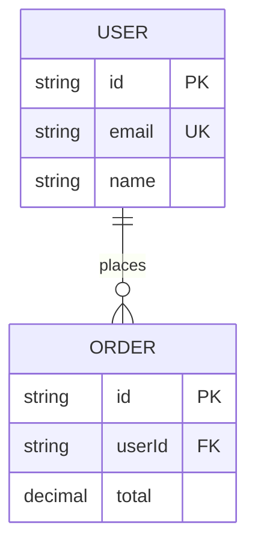
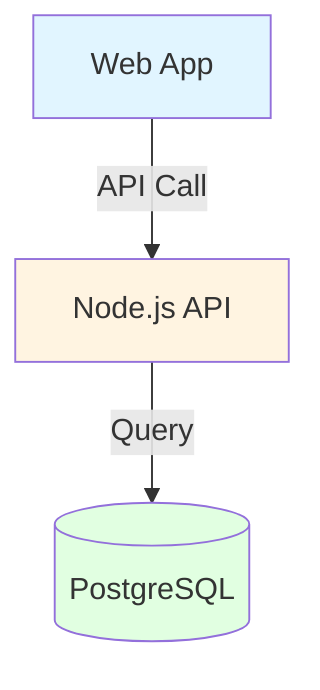
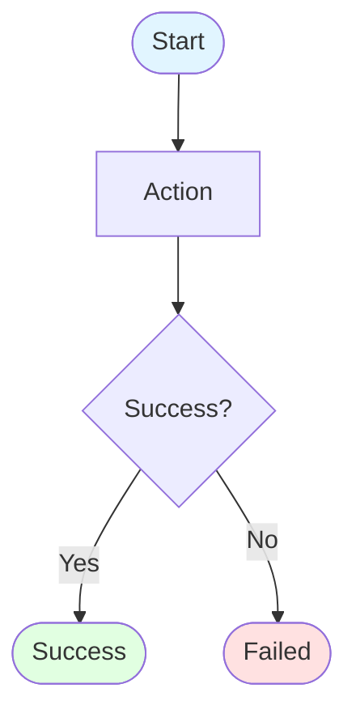

# 🎨 Mermaid Diagram Guidelines

Follow these critical rules for all Mermaid diagrams to ensure they render correctly in GitHub, VS Code, and other markdown viewers.

## 🛠️ General Rules

- **Code Fence:** ALWAYS use exactly ` ```mermaid ` (lowercase, no spaces).
- **NO Indentation:** Do not indent the diagram code with spaces or tabs.
- **Closing Fence:** Always close with ` ``` `.
- **Validation:** Preview at [mermaid.live](https://mermaid.live/) if unsure.
---
## 📊 Entity Relationship (ER) Diagrams

**Type:** `erDiagram`

### Relationship Notation

- `||--o{` : One-to-Many (one to zero or more)
- `||--||` : One-to-One (one to exactly one)
- `}o--o{` : Many-to-Many (requires junction table)
- `||--|{` : One-to-Many (one to one or more)

### Field Notation

- `PK` : Primary Key
- `FK` : Foreign Key
- `UK` : Unique Key
- Add descriptions in quotes: `string email "User email address"`

### Example


---
## 📐 Architecture & Flow Diagrams

**Type:** `graph TD` (Top-Down) or `graph LR` (Left-Right)

### Node Shapes

- `[Square]` : Services, components, apps
- `[(Cylinder)]` : Databases, storage
- `([Rounded])` : Start/End points
- `{Diamond}` : Decision points

### Styling

- Use `<br/>` for line breaks in labels.
- Apply colors: `style NodeName fill:#e1f5ff`
- Label connections: `A -->|HTTPS| B`

### Example


---
## 🔄 Business Flow Diagrams

**Type:** `flowchart TD` (or `flowchart LR`)

### Requirements

- Start/End with `([Terminal Node])`.
- Use `{Diamond}` for decision points.
- Label branches: `-->|Yes|` or `-->|No|`.
- Show error/failure paths.

### Example


---
## ⚠️ Common Mistakes to Avoid

- ❌ ` ```Mermaid ` (Capital M)
- ❌ ` ``` mermaid ` (Extra space)
- ❌ Using invalid characters in node IDs (use `NodeID[Label]` instead)
- ❌ Circular dependencies without clear flow


