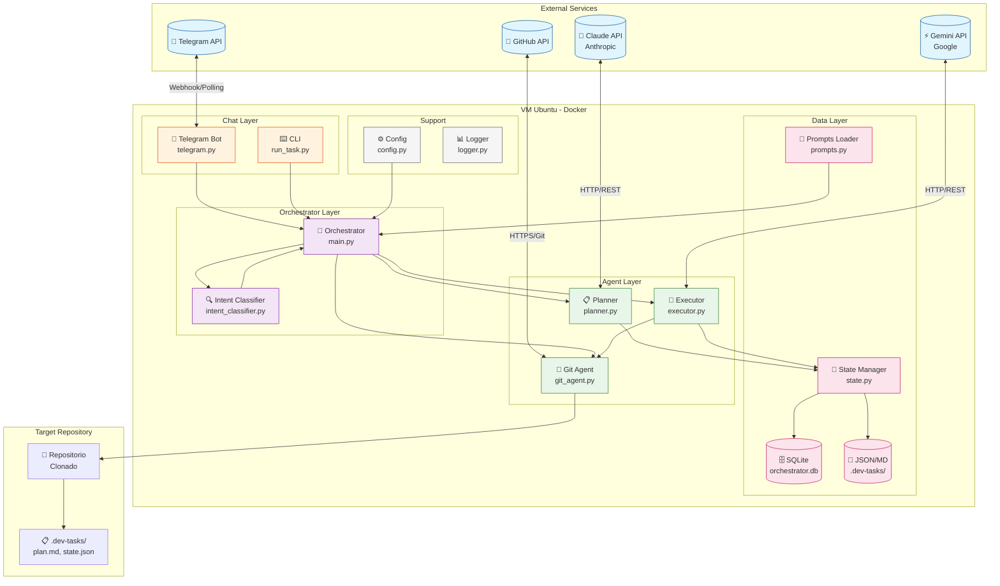
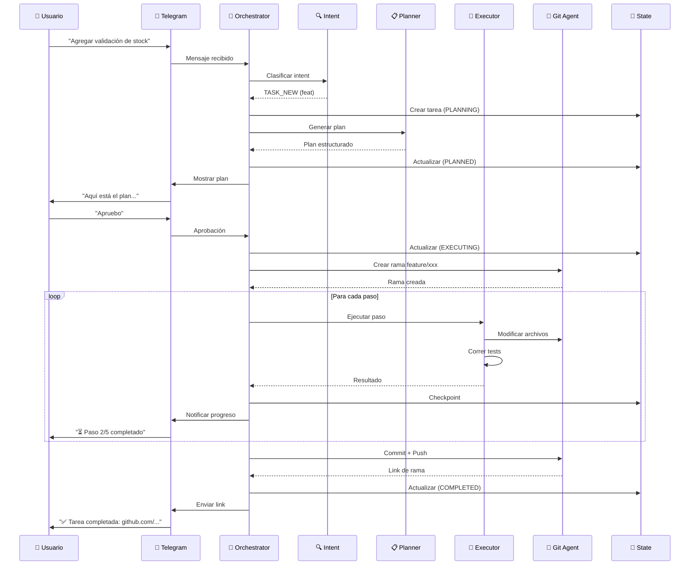
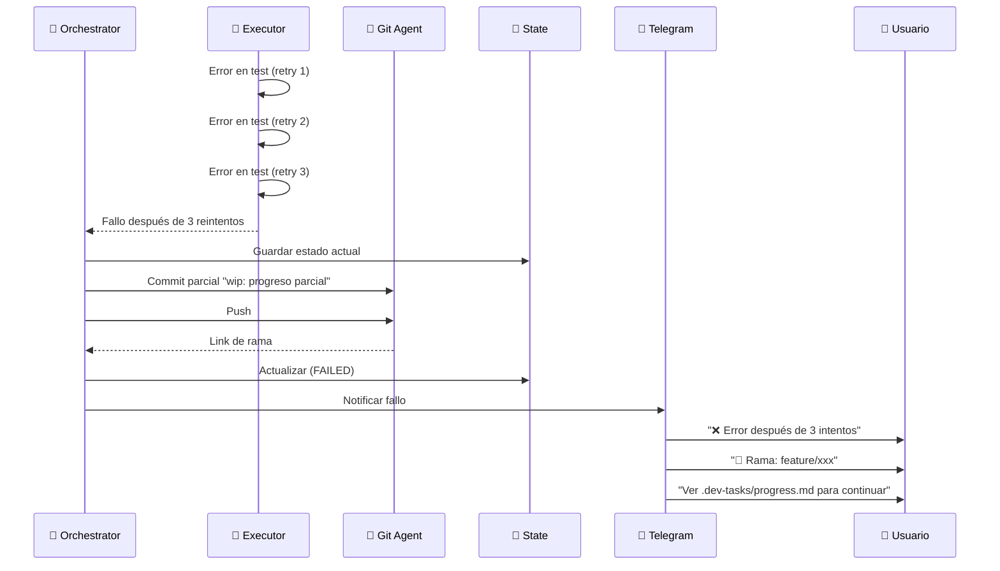

# System Architecture - Dev Task Orchestrator

> **Generado:** 2026-02-03  
> **Fase:** 3 - System Architecture

---

## 📊 Resumen de Arquitectura

| Aspecto           | Valor                                  |
| ----------------- | -------------------------------------- |
| **Tipo**          | Orquestador con Agentes Especializados |
| **Lenguaje**      | Python 3.11+                           |
| **Patrón**        | Modular con Agentes                    |
| **Runtime**       | Docker en VM Ubuntu                    |
| **Base de Datos** | SQLite + JSON                          |
| **Interfaces**    | CLI + Telegram Bot                     |

---

## 🏗️ Diagrama de Arquitectura



---

## 🧩 Componentes del Sistema

### 1. Chat Layer (Interfaces de Usuario)

| Componente       | Archivo            | Responsabilidad                                     |
| ---------------- | ------------------ | --------------------------------------------------- |
| **Telegram Bot** | `chat/telegram.py` | Recibe mensajes, envía respuestas y actualizaciones |
| **CLI**          | `run_task.py`      | Interfaz de línea de comandos para ejecución local  |

### 2. Orchestrator Layer (Coordinación)

| Componente            | Archivo                | Responsabilidad                                       |
| --------------------- | ---------------------- | ----------------------------------------------------- |
| **Orchestrator**      | `main.py`              | Coordina el flujo completo entre agentes              |
| **Intent Classifier** | `intent_classifier.py` | Detecta intención del mensaje (QUERY, TASK_NEW, etc.) |

### 3. Agent Layer (Agentes Especializados)

| Componente    | Archivo        | Responsabilidad                           |
| ------------- | -------------- | ----------------------------------------- |
| **Planner**   | `planner.py`   | Genera planes estructurados usando Claude |
| **Executor**  | `executor.py`  | Ejecuta código usando Gemini              |
| **Git Agent** | `git_agent.py` | Operaciones Git (branch, commit, push)    |

### 4. Data Layer (Persistencia)

| Componente         | Archivo      | Responsabilidad                   |
| ------------------ | ------------ | --------------------------------- |
| **State Manager**  | `state.py`   | CRUD de tareas, logs, checkpoints |
| **Prompts Loader** | `prompts.py` | Carga prompts desde `/ai/`        |

---

## 📁 Estructura de Directorios

```
dev-orchestrator/
│
├── orchestrator/                    # 📦 Código principal
│   ├── __init__.py
│   ├── main.py                      # Entry point del orquestador
│   ├── config.py                    # Configuración y variables de entorno
│   ├── intent_classifier.py         # Clasificador de intenciones
│   ├── planner.py                   # Integración con Claude
│   ├── executor.py                  # Integración con Gemini
│   ├── git_agent.py                 # Operaciones Git
│   ├── state.py                     # Gestión de estado (SQLite + JSON)
│   ├── prompts.py                   # Cargador de prompts
│   │
│   ├── chat/                        # 💬 Interfaces de chat
│   │   ├── __init__.py
│   │   ├── telegram.py              # Telegram Bot
│   │   └── base.py                  # Interfaz base
│   │
│   ├── models/                      # 📊 Modelos de datos
│   │   ├── __init__.py
│   │   ├── task.py                  # Task, TaskStatus, TaskType
│   │   ├── plan.py                  # Plan, Step
│   │   └── checkpoint.py            # Checkpoint
│   │
│   └── utils/                       # 🔧 Utilidades
│       ├── __init__.py
│       ├── logger.py                # Logging configurado
│       └── helpers.py               # Funciones auxiliares
│
├── ai/                              # 🤖 Prompts del sistema
│   ├── system/
│   │   └── base.md                  # Reglas globales
│   ├── planner/
│   │   ├── role.md                  # Rol del planner
│   │   └── constraints.md           # Restricciones
│   ├── executor/
│   │   ├── role.md                  # Rol del executor
│   │   └── coding_rules.md          # Reglas de codificación
│   ├── git/
│   │   └── rules.md                 # Reglas de Git
│   └── testing/
│       └── rules.md                 # Reglas de testing
│
├── tests/                           # 🧪 Tests
│   ├── __init__.py
│   ├── test_intent_classifier.py
│   ├── test_planner.py
│   ├── test_executor.py
│   ├── test_git_agent.py
│   └── test_state.py
│
├── scripts/                         # 📜 Scripts auxiliares
│   ├── setup_vm.sh                  # Configuración de la VM
│   └── backup_db.sh                 # Backup de SQLite
│
├── docs/                            # 📚 Documentación
│   ├── architecture.md              # Este documento
│   ├── data-model.md                # Modelo de datos
│   └── api.md                       # Documentación de APIs
│
├── docker-compose.yml               # 🐳 Docker Compose
├── Dockerfile                       # 🐳 Dockerfile
├── .env.example                     # 🔐 Variables de entorno ejemplo
├── .gitignore
├── requirements.txt                 # 📦 Dependencias
├── pyproject.toml                   # 📦 Configuración del proyecto
├── run_task.py                      # 🚀 CLI entry point
├── project-brief.md                 # 📋 Brief del proyecto
└── README.md                        # 📖 Documentación principal
```

---

## 🔄 Flujo de Datos

### Flujo Principal: Nueva Tarea



### Flujo de Error/Timeout



---

## 🔌 Integraciones Externas

### APIs Utilizadas

| API                    | Propósito               | Librería              | Auth      |
| ---------------------- | ----------------------- | --------------------- | --------- |
| **Anthropic (Claude)** | Planificación de tareas | `anthropic`           | API Key   |
| **Google AI (Gemini)** | Ejecución de código     | `google-generativeai` | API Key   |
| **GitHub**             | Push, branches          | `GitPython` + HTTPS   | Token     |
| **Telegram**           | Chat interface          | `python-telegram-bot` | Bot Token |

### Configuración de APIs

```python
# config.py
from pydantic_settings import BaseSettings

class Settings(BaseSettings):
    # AI Providers
    ANTHROPIC_API_KEY: str
    GOOGLE_API_KEY: str

    # GitHub
    GITHUB_TOKEN: str

    # Telegram
    TELEGRAM_BOT_TOKEN: str

    # Paths
    REPOS_PATH: str = "/opt/dev-orchestrator/repos"
    LOGS_PATH: str = "/opt/dev-orchestrator/logs"
    DATA_PATH: str = "/opt/dev-orchestrator/data"

    # Limits
    MAX_EXECUTION_TIME: int = 1800  # 30 min
    MAX_RETRIES: int = 3
    CHECKPOINT_INTERVAL: int = 300  # 5 min
    MAX_CLARIFICATION_ROUNDS: int = 10

    class Config:
        env_file = ".env"
```

---

## 🐳 Configuración Docker

### Dockerfile

```dockerfile
FROM python:3.11-slim

WORKDIR /app

# Install system dependencies
RUN apt-get update && apt-get install -y \
    git \
    && rm -rf /var/lib/apt/lists/*

# Install Python dependencies
COPY requirements.txt .
RUN pip install --no-cache-dir -r requirements.txt

# Copy application code
COPY . .

# Create directories
RUN mkdir -p /opt/dev-orchestrator/repos \
             /opt/dev-orchestrator/logs \
             /opt/dev-orchestrator/data

# Run the application
CMD ["python", "-m", "orchestrator.main"]
```

### docker-compose.yml

```yaml
version: "3.8"

services:
  orchestrator:
    build: .
    container_name: dev-orchestrator
    restart: unless-stopped
    env_file:
      - .env
    volumes:
      - ./repos:/opt/dev-orchestrator/repos
      - ./logs:/opt/dev-orchestrator/logs
      - ./data:/opt/dev-orchestrator/data
      - ./ai:/app/ai:ro
      - /var/run/docker.sock:/var/run/docker.sock # Docker-in-Docker
    networks:
      - orchestrator-net

networks:
  orchestrator-net:
    driver: bridge
```

---

## 📦 Dependencias

### requirements.txt

```txt
# Core
python-dotenv>=1.0.0
httpx>=0.27.0
aiofiles>=23.0.0

# AI Providers
anthropic>=0.18.0
google-generativeai>=0.4.0

# Chat
python-telegram-bot>=21.0

# CLI
typer>=0.9.0
rich>=13.0.0

# Git
GitPython>=3.1.0

# Data Validation
pydantic>=2.5.0
pydantic-settings>=2.1.0

# Utilities
tenacity>=8.2.0

# Testing
pytest>=8.0.0
pytest-asyncio>=0.23.0
pytest-cov>=4.1.0
```

---

## 🔐 Variables de Entorno

### .env.example

```bash
# =============================================================================
# Dev Task Orchestrator - Environment Variables
# =============================================================================

# -----------------------------------------------------------------------------
# AI Providers
# -----------------------------------------------------------------------------
ANTHROPIC_API_KEY=sk-ant-xxxxx
GOOGLE_API_KEY=xxxxx

# -----------------------------------------------------------------------------
# GitHub
# -----------------------------------------------------------------------------
GITHUB_TOKEN=ghp_xxxxx

# -----------------------------------------------------------------------------
# Telegram
# -----------------------------------------------------------------------------
TELEGRAM_BOT_TOKEN=123456:ABC-xxxxx

# -----------------------------------------------------------------------------
# Paths (inside Docker)
# -----------------------------------------------------------------------------
REPOS_PATH=/opt/dev-orchestrator/repos
LOGS_PATH=/opt/dev-orchestrator/logs
DATA_PATH=/opt/dev-orchestrator/data

# -----------------------------------------------------------------------------
# Execution Limits
# -----------------------------------------------------------------------------
MAX_EXECUTION_TIME=1800
MAX_RETRIES=3
CHECKPOINT_INTERVAL=300
MAX_CLARIFICATION_ROUNDS=10

# -----------------------------------------------------------------------------
# Logging
# -----------------------------------------------------------------------------
LOG_LEVEL=INFO
```

---

## 🚀 Ejecución

### Desarrollo Local

```bash
# Clonar repositorio
git clone https://github.com/user/dev-orchestrator.git
cd dev-orchestrator

# Crear entorno virtual
python -m venv venv
source venv/bin/activate  # Linux/Mac
# o: venv\Scripts\activate  # Windows

# Instalar dependencias
pip install -r requirements.txt

# Configurar variables de entorno
cp .env.example .env
# Editar .env con tus API keys

# Ejecutar CLI
python run_task.py --help

# Ejecutar Telegram Bot
python -m orchestrator.main
```

### Producción (Docker)

```bash
# Build
docker-compose build

# Run
docker-compose up -d

# Logs
docker-compose logs -f orchestrator

# Stop
docker-compose down
```

---

## 📊 Monitoreo

### Logs

```
/opt/dev-orchestrator/logs/
├── orchestrator.log          # Log principal
├── error.log                 # Solo errores
└── {task-id}/
    ├── execution.log         # Log de ejecución
    └── checkpoints/          # Snapshots
```

### Health Check (futuro)

```python
# Endpoint simple para verificar estado
async def health_check():
    return {
        "status": "healthy",
        "version": "1.0.0",
        "database": "connected",
        "telegram": "connected"
    }
```

---

## 🔄 Escalabilidad (Futuro)

Si el proyecto crece:

| Componente   | Actual     | Escalado             |
| ------------ | ---------- | -------------------- |
| **Database** | SQLite     | PostgreSQL           |
| **State**    | Local JSON | Redis                |
| **Queue**    | Sincrónico | Celery/RabbitMQ      |
| **Metrics**  | Logs       | Prometheus + Grafana |
| **Deploy**   | Single VM  | Kubernetes           |

---

_Documento generado por AI Flow - Phase 3: System Architecture_
